<!-- Repository name -->
<h1>:wrench: Service center: "We'll fix it!" :wrench:</h1>

<!-- Translates -->

<!-- Table of contents -->
<h2>Table of contents</h2>
<ul>

<!-- Installation -->
<li>
    <a href="#installation">Installation</a>
    <ul>
        <li>
            <a href="#installation-clone">Clone this repository</a>
        </li>
        <li>
            <a href="#installation-go-to-dir">Open directory</a>
        </li>
        <li>
            <a href="#installation-docker">Docker installation</a>
        </li>
        <li>
            <a href="#installation-manual">Manual installation</a>
        </li>
    </ul>
</li>

<!-- Launch -->
<li>
    <a href="#launch">Launch</a>
</li>

<!-- Demonstration -->
<li>
    <a href="#demo">Demonstration</a>
    <ul>
        <li><a href="#pages">Normal pages</a></li>
        <li>
            <a href="#accounts">Accounts</a>
            <ul>
                <li><a href="#accounts-register">Sign up</a></li>
                <li><a href="#accounts-login">Sign in</a></li>
            </ul>
        </li>
        <li>
            <a href="#orders">Orders</a>
        </li>
        <li>
            <a href="#adminpanel">Admin-panel</a>
        </li>
    </ul>
</li>

<!-- Remarks -->
<li>
    <a href="#remark">Remarks</a>
</li>
</ul

<!-- Installation -->
<h2><a id="installation">Installation</a></h2>
<ul>
<!-- Clone this repository -->
<li>
    <a id="installation-clone">Clone this repository</a>
    <pre>git clone https://github.com/SkalZOne/Laravel_ServiceCenter</pre>
</li>
<!-- Open directory -->
<li>
    <a id="installation-go-to-dir">Open directory</a>
    <pre>cd Laravel_ServiceCenter</pre>
</li>

<h3>Next there are 2 options to install:</h3>
<ul>
<!-- Docker install -->
<li>

<a id="installation-docker"><h3>:whale: Docker installation :whale:</h3></a>

<ul>
<li>
create .env file
<pre>cp .env.docker.example .env</pre>
</li>
<li>
Go to line 22 and set up a connection to the docker database 
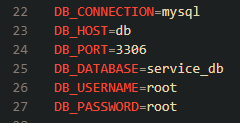
</li>
<li>
Up Docker container
<pre>docker-compose up -d</pre>
</li>
<li>
When you first launch, you will begin installing all the dependencies, this may take a lot of time, be patient
</li>
<li>
After you see these points in the terminal, indicating that the container was successfully lifted, proceed to further actions. 
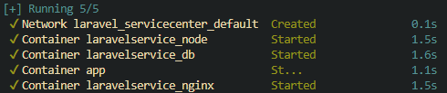
</li>
<li>
⚠️All subsequent commands for Laravel are now executed through a special command:
<pre>docker exec app <command></pre>
</li>
<li>
Next you need to carry out migrations for the database
<pre>docker exec app php artisan migrate</pre>
</li>
<li>
You also need to create an encryption key for Laravel:
<pre>docker exec app php artisan key:generate</pre>
</li>
</ul>
<h3>:white_check_mark: Congratulations :white_check_mark:</h3>
You have successfully raised a container via Docker.
 
The site is located at this address: <code>http://localhost:8876/</code>
 
In order to shut down the container, you will need to run this command:
<pre>docker-compose down</pre>
To start:
<code>docker-compose up -d</code>

</li>
<!-- Manual -->
<li>

<a id="installation-manual"><h3>:point_right: Manual installation  :point_left:</h3></a>

<ul>
<li>
<h4>Installation of required dependencies</h4>
<ul>

If composer or node.js is missing

 

Composer

> -   Follow this [link](https://getcomposer.org/download/) 
>     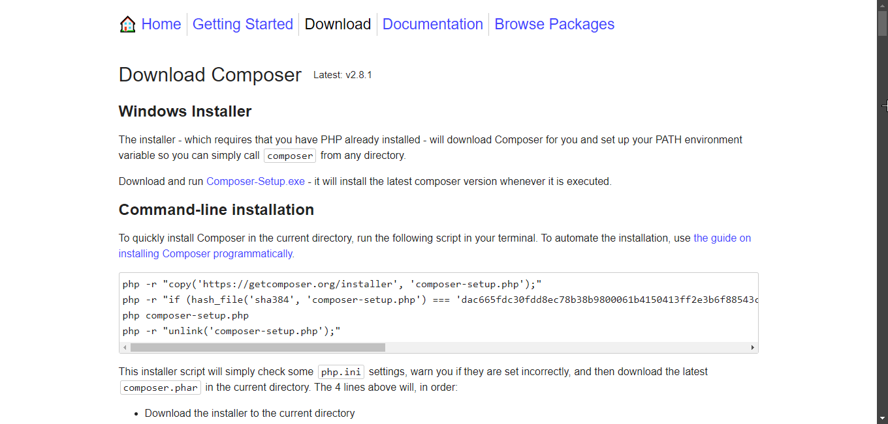
> -   Follow this link **Composer-Setup.exe** and open executable file
> -   Select one of the installation methods 
>     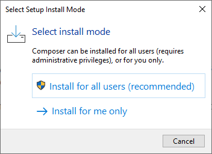
> -   Click next
> -   Select the path to installed PHP 
>     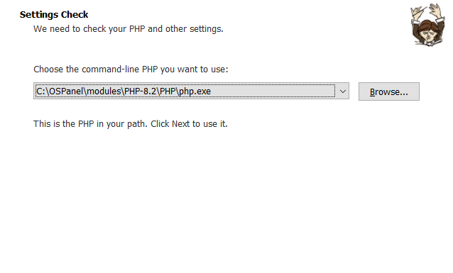
> -   Click next 2 times
> -   Click install
> -   Ready! :white_check_mark:

 

Node.js

> -   Follow this [link](https://nodejs.org/en) 
>     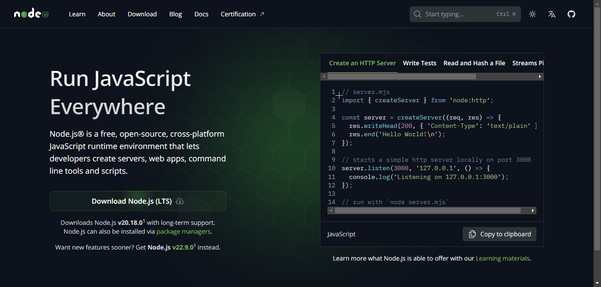
> -   Click on the button **Download Node.js (LTS)** and open executable file
> -   Click next
> -   Accept user agreement
> -   Select installation path 
>     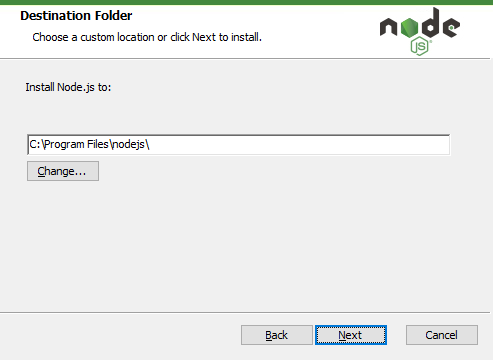
> -   Click next 2 times
> -   Click install
> -   Ready! :white_check_mark:

</ul>
<li>
Run these commands in the terminal:
<code>composer install</code> и
<code>npm install</code>
</li>
<li>
Create .env file and configure it
<pre>cp .env.example .env</pre>
</li>
<li>
:warning: If you do not have a server with a database, do not change anything in this file, but simply skip further steps at this point, except migration
<ul>
<li>
Open the created file and go to line 22
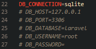
</li>
<li>
Edit the values ​​depending on your database, in my case it looks like this:
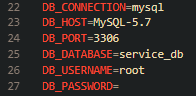
</li>
<li>
Now you need to run the migration
<pre>php artisan migrate</pre>
</li>
<li>
Create an encryption key in Laravel
<pre>php artisan key:generate</pre>
</li>
</ul>
</li>
</li>

 
</li>
</ul>

✅Great, you can now move on to the "Launch" section.✅
</ul>

<!-- Launch -->
<h2><a id="launch">Launch</a></h2>
<h3>To launch the site you need to open 2 terminals</h3>
<ul>
    <!-- First -->
    <li>
        The first:
        <ul>
            <li>
                Go to frontend folder
                <pre>cd frontend</pre>
            </li>
            <li>
                Start the development server
                <pre>npm run dev</pre>
            </li>
        </ul>
        After these steps, the local next.js server will be launched for development at <b>localhost:3000</b>
    </li>
    <!-- Second -->
    <li>
        Second:
        <ul>
            <li>
                Go to backend folder
                <pre>cd backend</pre>
            </li>
            <li>
                Start the development server
                <pre>php artisan serve</pre>
            </li>
        </ul>
        This command will launch laravel at <b>localhost:8000</b>.
    </li>
</ul>
<h4>✅ Done, now when you go to <b>localhost:8000</b> the main web interface of the application will open. ✅</h4>

<!-- Demonstration -->
<h2><a id="demo">Demonstration</a></h2>
<ul>
<li>
    <h3><a id="pages">Normal pages</a></h3>
    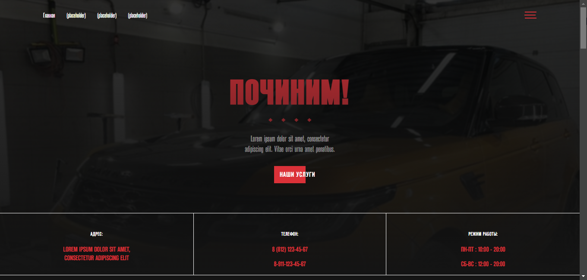
    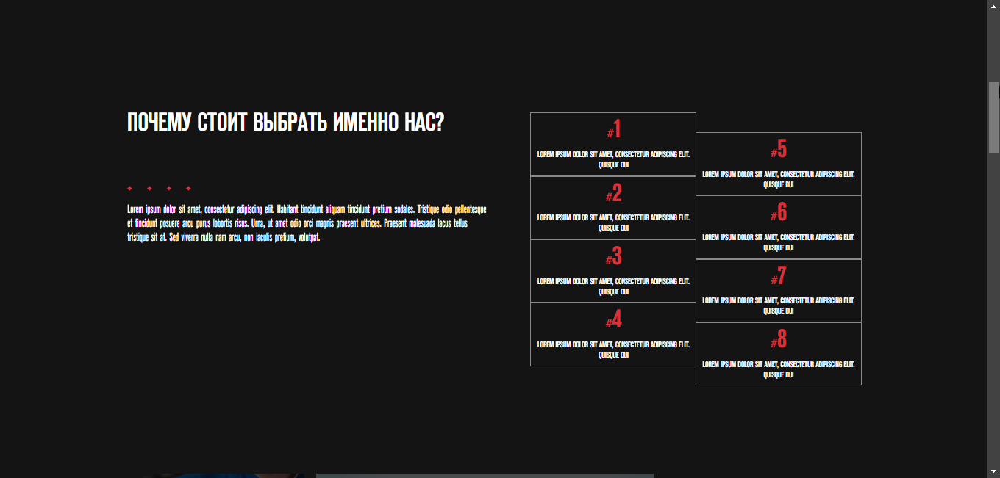
    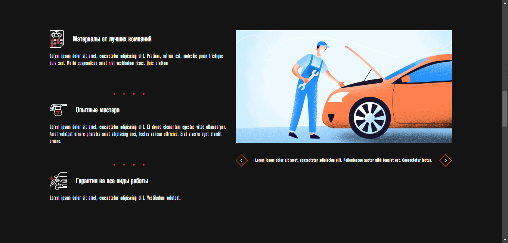
    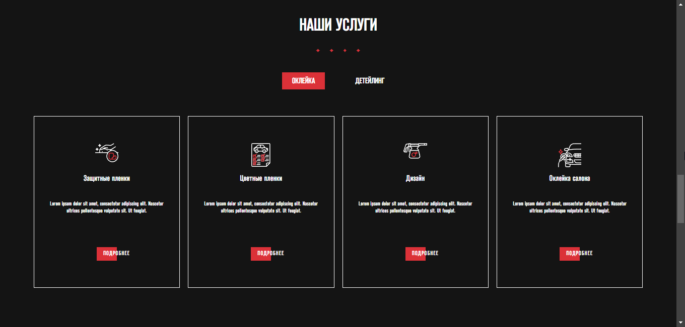
    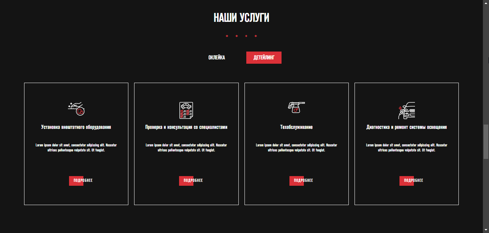
</li>
<li>
    <h3><a id="accounts">Accounts</a></h3>
    <ul>
        <li>
            <h4><a id="accounts-register">Sign up</a></h4>
            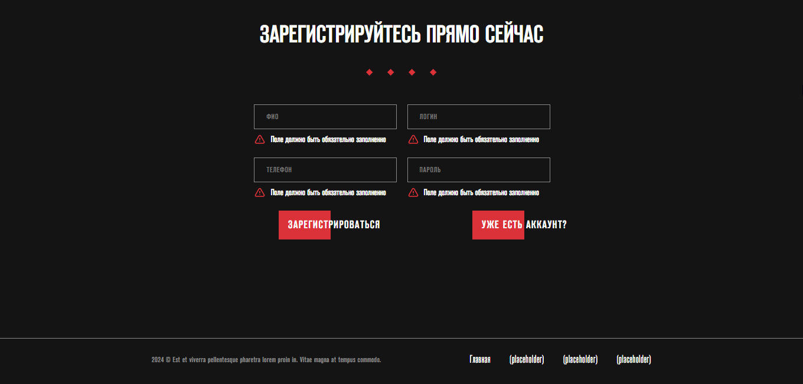
            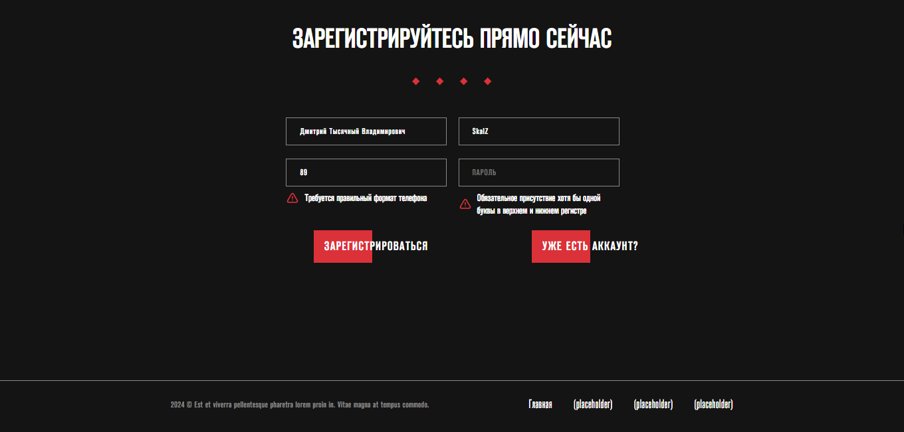
        </li>
        <li>
            <h4><a id="accounts-login">Sign in</a></h4>
            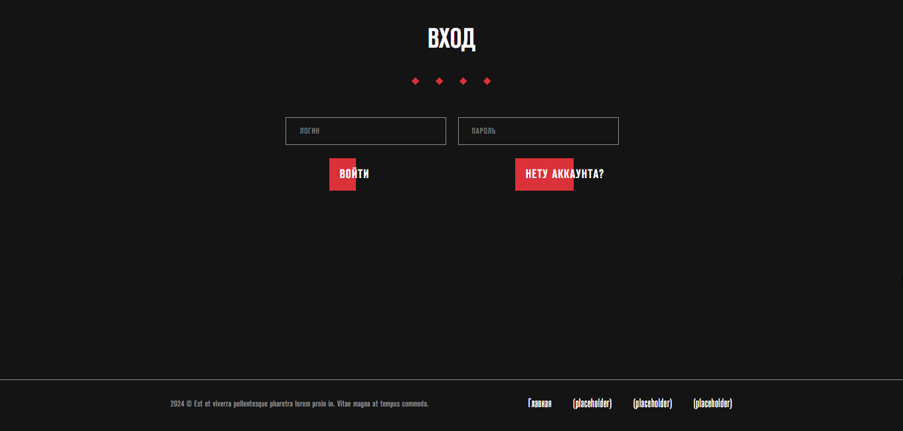
            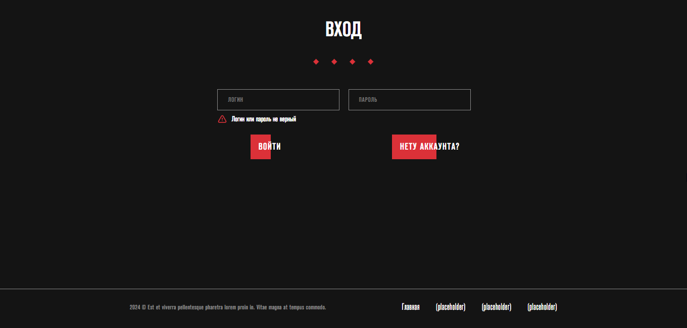
        </li>
    </ul>
</li>
<li>
    <h3><a id="orders">Orders</a></h3>
    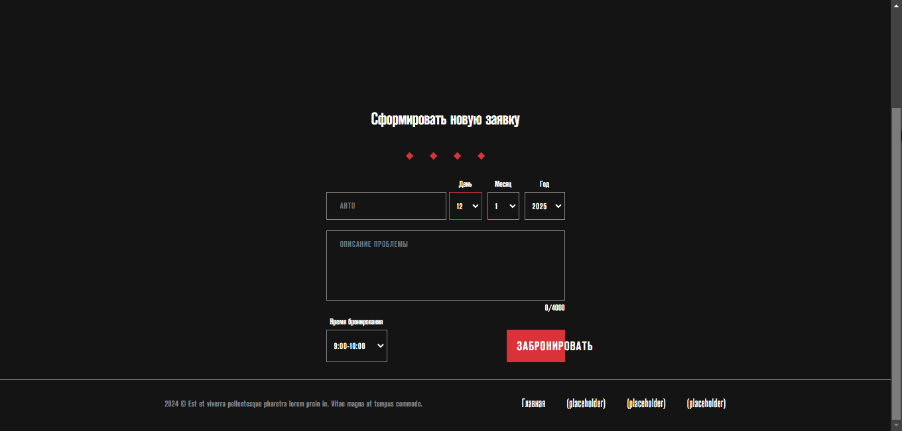
    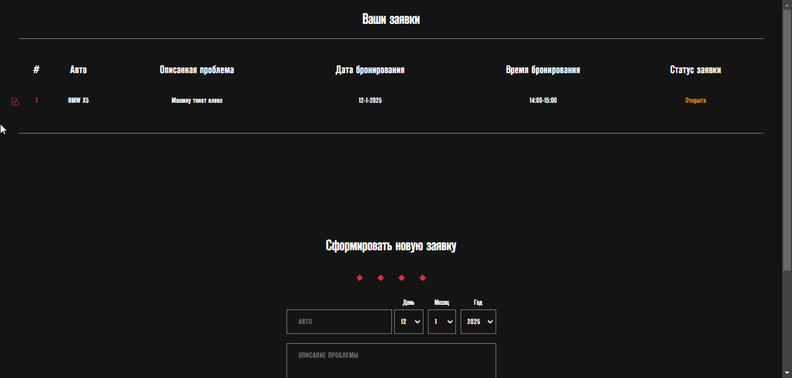
    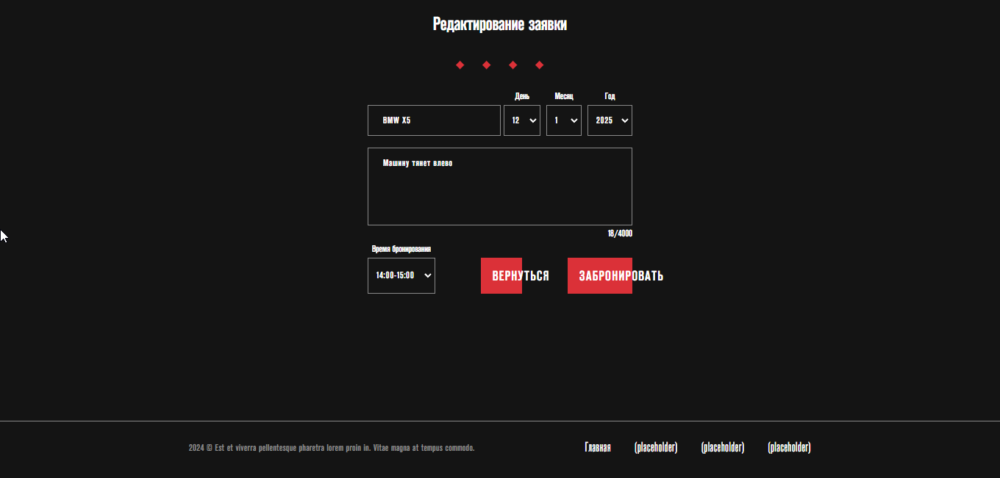
</li>
<li>
    <h3><a id="adminpanel">Admin-panel</a></h3>
    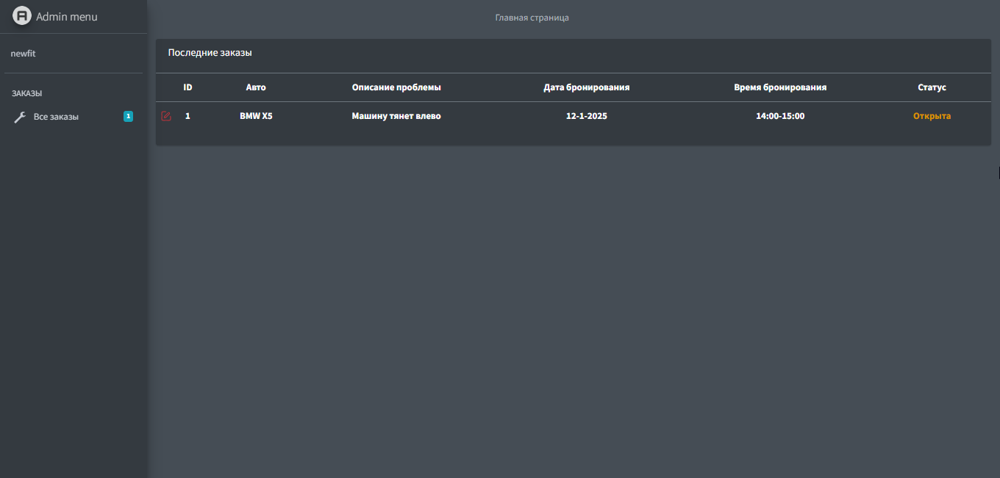
    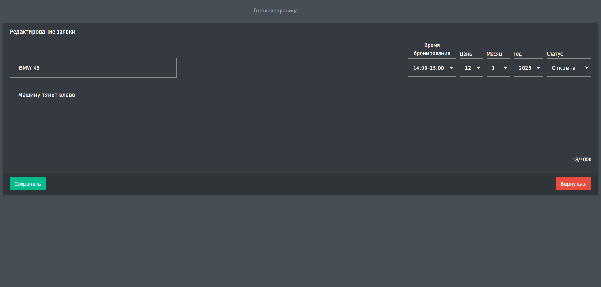
</li>
</ul>

<!-- Remarks -->
<h2><a id="remark">Remarks</a></h2>
<ul>
    <li>An admin account is created using the "newfit" login, any password</li>
</ul>