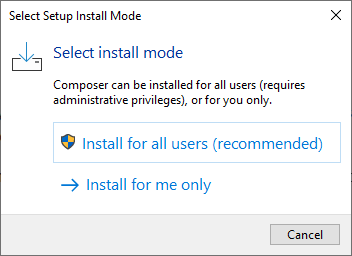

# :wrench: Сервисный центр: "Починим!" :wrench:

## Установка

### Склонировать данный репозиторий и перейти в директорию

```
git clone https://github.com/SkalZOne/Laravel_ServiceCenter
```

```
cd Laravel_ServiceCenter
```

### Установить необходимые зависимости:

<details>
<summary>Если composer или node.js отсутствуют</summary>

<details> 
<summary>Composer</summary>

> -   Перейти по данной [ссылке](https://getcomposer.org/download/) >
>
> -   Кликнуть по ссылке **Composer-Setup.exe** и открыть исполняемый файл
> -   Выбрать один из методов установки
>     
> -   Нажать далее
> -   Выбрать путь до установленного PHP
>     
> -   Нажать 2 раза далее
> -   Нажать установить
> -   Готово! :white_check_mark:

</details>

<details> 
<summary>Node.js</summary>

> -   Перейти по данной [ссылке](https://nodejs.org/en) >
>
> -   Кликнуть по кнопке **Download Node.js (LTS)** и открыть исполняемый файл
> -   Нажать далее
> -   Принять пользовательское соглашение
> -   Выбрать путь установки
>     
> -   Нажать 2 раза далее
> -   Нажать установить
> -   Готово! :white_check_mark:

</details>
</details>

<br>

Выполнить данные команды в терминале:

```
composer install
```

```
npm install
```

### Создать .env файл и настроить его

-   ```
    cp .env.example .env
    ```

#### :warning: В случае, если у вас не стоит сервер с базой данных, ничего не меняйте в данном файле, а просто пропустите дальнейшие действия в данном пункте, кроме миграции

-   Открыть созданный файл и перейти на 22 строку

    

-   Отредактировать значения в зависимости от вашей базы данных, в моем случае это выглядит так:

    

- Теперь требуется запустить миграцию

    ```
    php artisan migrate
    ```

### Создать encryption key в Laravel

```
php artisan key:generate
```

Отлично, теперь вы можете переходить к разделу "Запуск"


## Запуск

### Для запуска сайта требуется открыть 2 терминала

#### В первом требуется прописать:

```
npm run dev
```

Данная команда запустить сборщик vite, для компиляции scss и js файлов

#### Во втором требуется прописать:

```
php artisan serve
```

Данная команда запустит основной сервер, на вашей машине, для работы Laravel.

После данной команды вылезет такой вывод из консоли


При переходе на данную ссылку в браузере у вас откроется сайт.

## Примечания

- Админ аккаунт создается по логину newfit, пароль любой